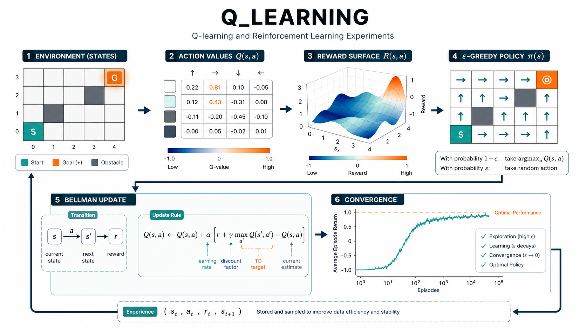

# Q-Learning Pricing Experiments

    

  <strong>Reinforcement-learning notebooks for pricing, mixed strategy games, and auction references.</strong>

  

The overview figure describes the RL loop used by the project: define states and rewards, update action values, improve the policy, and track convergence against pricing objectives.

## Overview

Q-Learning Pricing Experiments keeps notebooks, reference papers, and report artifacts for studying pricing and mixed-strategy games through reinforcement learning. The code folder separates reusable Q-learning assets from exploratory notebooks and written references.

## What Is Included

- `Q_learning_code/`: core implementation folder for reusable Q-learning code.
- `AM_model_thirdversion.ipynb`, `betrand_cost.ipynb`, `cycle.ipynb`: experiment notebooks.
- `graph/`: saved plots and graph artifacts.
- `report1/`, `report2/`: written result folders.
- `q-learninng_for_pricing_mixed_strategy_game.docx`: project write-up for the pricing game experiment.

## Quick Start

1. `git clone git@github.com:Hik289/Q_learning.git`
2. `python -m venv .venv && source .venv/bin/activate`
3. `python -m pip install -U pip jupyter numpy pandas scipy matplotlib`
4. Start with the notebooks, then move reusable code into `Q_learning_code/` when an experiment stabilizes.

## Suggested Workflow

1. Start with the smallest runnable script or notebook listed above.
2. Keep raw data paths and credentials outside the repository.
3. Save generated figures, tables, and reports under the existing result folders.
4. When an experiment becomes stable, record the exact data window, parameters, and command used to reproduce it.

## Repository Map

- `assets/readme-figure.png`: README overview figure.
- Project scripts and notebooks: core research entry points.
- Result or report folders: generated artifacts used for analysis and review.

## Paper or Reference

No external paper link is currently attached to this project. For now, the code, notebooks, and notes in this repository are the primary reference artifact.

## License

No explicit license file is included yet. Add one before public reuse, redistribution, or package release.

## Maintenance Notes

- Add a pinned environment file if this project is prepared for external installation.
- Keep large datasets outside Git and document where each script expects them locally.
- Prefer small, named experiment outputs over overwriting shared result files.
